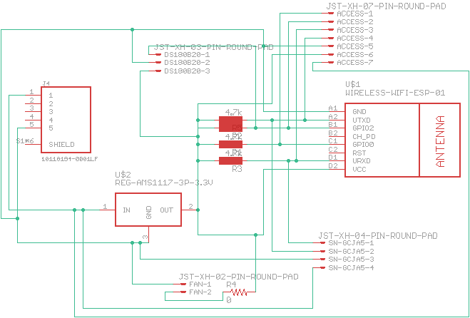
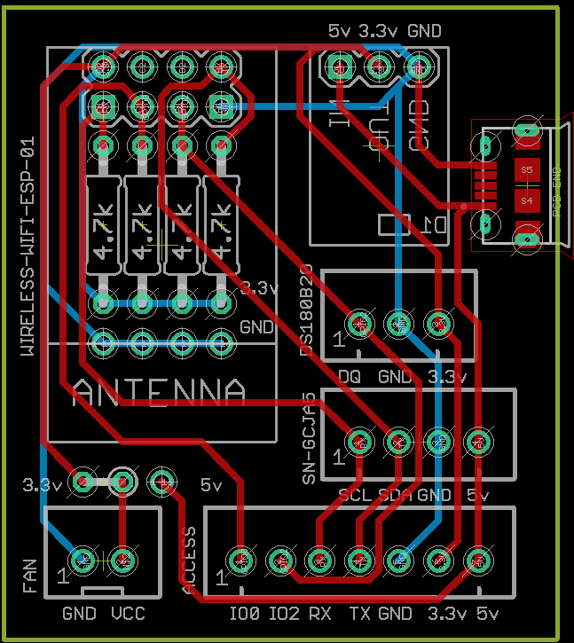
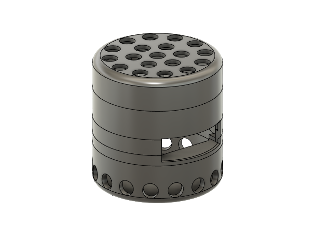

# Air Quality Sensor

This project runs on an ESP8266, using MQTT over Wifi to send the air quality and temperature information back to openHAB.

## Software

[Arduino project for ESP8266 board](esp8266-mqtt-panasonic-air-quality-sensor).

## Wiring Schematic

## Circuit Board

[Eagle project](circuit-board/eagle)

I used the [OSH Park](https://oshpark.com/) service to fabricate the board for this project, sending them [just the board file](circuit-board/eagle/air-quality.brd).

## Project Box

Designed in Autodesk Fusion 360, available on [Thingiverse](https://www.thingiverse.com/thing:4777796).

## BOM

 - ESP-01S Wifi microcontroller ([something like this](https://www.amazon.com/gp/product/B01N98BTRH/ref=ppx_od_dt_b_asin_title_s00?ie=UTF8&psc=1))
 - [Panasonic SN-GCJA5](https://www.sparkfun.com/products/17123)
 - DS18B20 temperature sensor ([TO92](https://www.digikey.com/product-detail/en/maxim-integrated/DS18B20-/DS18B20--ND/956983)
 - AMS1117 3pin stepdown breakout board ([one of many to be found](https://www.amazon.com/gp/product/B07CP4P5XJ/ref=ppx_yo_dt_b_asin_title_o03_s00?ie=UTF8&psc=1))
 - 2x 4.7k Ohm resistors ([no particular reason to use these](https://www.amazon.com/gp/product/B0185FIIVE/ref=ppx_yo_dt_b_asin_title_o01_s00?ie=UTF8&psc=1))
 - 2.54mm Pitch 2X4 8 Pin Female Double Row Straight Header PCB Connector ([I used these](https://www.amazon.com/gp/product/B01IHBCO2K/ref=ppx_yo_dt_b_asin_title_o09_s00?ie=UTF8&psc=1))
 - USB Micro B power connector ([parallel](https://www.digikey.com/product-detail/en/amphenol-icc-fci/10118194-0001LF/609-4618-1-ND/2785382) or [perpendicular](https://www.digikey.com/product-detail/en/gct/USB3131-30-0230-A/2073-USB3131-30-0230-ACT-ND/9859713) to the board) 
 - 5v USB power supply (I just used one of the many that I have from dead cell phones and such)
