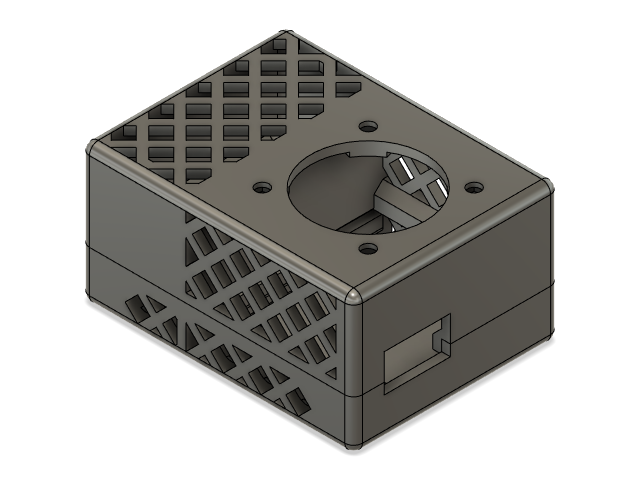

# Temperature Sensor

This project runs on an ESP8266, using MQTT over Wifi to send the temperature back to openHAB.

I created a custom circuit board to make it a little more durable and reliable.

I have used both the TO92 and the waterproof probes.

I ran into a fair bit of issues with heat from the components being picked up by the sensor, even with the extended traces on the circuit board. In the end I gave on on elegant solutions and just stuck a fan on the thing to keep the ambient air circulating over the sensor. The fan is only being driven by 5v, but I used a 12v fan so that it would spin slow, and thus be quiet, to assist in the WAF of the project. Unfortunately that also meant that the fan sometimes does not have enough voltage to start spinning - once it is going it is fine, but it sometimes needs a push.

## Software

[Arduino project for ESP8266 board](esp8266-mqtt-single-ds18b20-sensor).

## Wiring Schematic

## Circuit Board

[Eagle project](circuit-board)

I used the [OSH Park](https://oshpark.com/) service to fabricate the board for this project, sending them [this zip file](circuit-board/export/temp sensor_2020-01-11.zip) with the Gerber (and other) files.

## Project Box

Designed in Autodesk Fusion 360, available on [Thingiverse](https://www.thingiverse.com/thing:4508169).

## BOM

 - ESP-01S Wifi microcontroller ([something like this](https://www.amazon.com/gp/product/B01N98BTRH/ref=ppx_od_dt_b_asin_title_s00?ie=UTF8&psc=1))
 - DS18B20 temperature sensor ([TO92](https://www.digikey.com/product-detail/en/maxim-integrated/DS18B20-/DS18B20--ND/956983) or [waterproof](https://www.amazon.com/Gikfun-DS18B20-Temperature-Waterproof-EK1083x3/dp/B012C597T0/ref=sr_1_3?crid=3AA1NY9ENGP12&dchild=1&keywords=ds18b20&qid=1593380354&sprefix=ds18%2Caps%2C232&sr=8-3))
 - AMS1117 3pin stepdown breakout board ([one of many to be found](https://www.amazon.com/gp/product/B07CP4P5XJ/ref=ppx_yo_dt_b_asin_title_o03_s00?ie=UTF8&psc=1))
 - 2x 4.7k Ohm resistors ([no particular reason to use these](https://www.amazon.com/gp/product/B0185FIIVE/ref=ppx_yo_dt_b_asin_title_o01_s00?ie=UTF8&psc=1))
 - 2.54mm Pitch 2X4 8 Pin Female Double Row Straight Header PCB Connector ([I used these](https://www.amazon.com/gp/product/B01IHBCO2K/ref=ppx_yo_dt_b_asin_title_o09_s00?ie=UTF8&psc=1))
 - 30x30x10mm 2pin 12v computer fan ([not great but it worked](https://www.amazon.com/gp/product/B071KK1KBG/ref=ppx_yo_dt_b_asin_title_o09_s00?ie=UTF8&psc=1))
 - USB Micro B power connector ([parallel](https://www.digikey.com/product-detail/en/amphenol-icc-fci/10118194-0001LF/609-4618-1-ND/2785382) or [perpendicular](https://www.digikey.com/product-detail/en/gct/USB3131-30-0230-A/2073-USB3131-30-0230-ACT-ND/9859713) to the board) 
 - 5v USB power supply (I just used one of the many that I have from dead cell phones and such)
