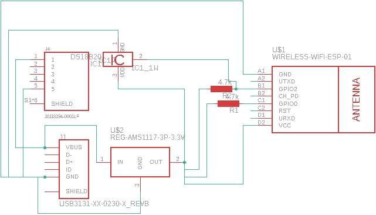
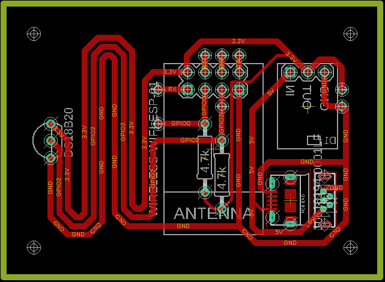

# Temperature Sensor Circuit Board

[../Project documentation](../)

This board was designed in Autodesk Eagle, project files are in the [eagle directory](eagle).

I used the [OSH Park](https://oshpark.com/) service to fabricate the board for this project, sending them [this zip file](export/temp sensor_2020-01-11.zip) with the Gerber (and other) files.

## Wiring Schematic

## Circuit Board

